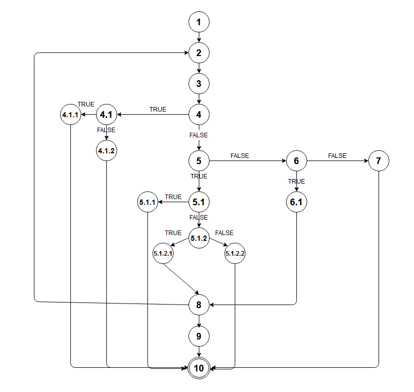
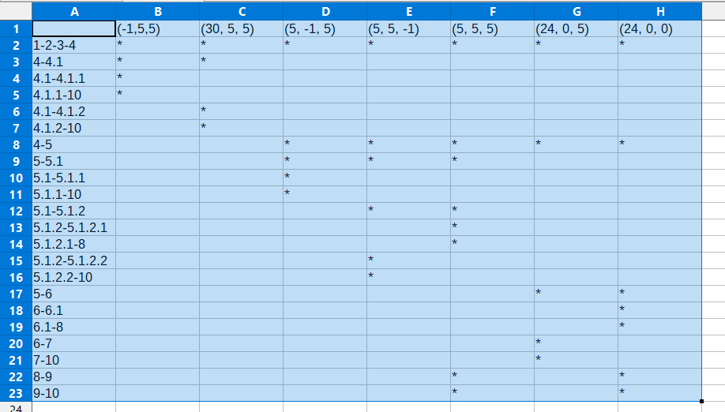

1. КОДОТ
import java.util.ArrayList;
import java.util.List;

class Time {
    int hours;
    int minutes;
    int seconds;

    public Time(int hours, int minutes, int seconds) {
        this.hours = hours;
        this.minutes = minutes;
        this.seconds = seconds;
    }

    public int getHours() {
        return hours;
    }

    public int getMinutes() {
        return minutes;
    }

    public int getSeconds() {
        return seconds;
    }
};

public class SILab2 {

    public List<Integer> function(List<Time> timesList) {
        List<Integer> result = new ArrayList<>();//1

        for (int i = 0; i < timesList.size(); i++) {//2
            int hr = timesList.get(i).getHours();//3
            int min = timesList.get(i).getMinutes();/3
            int sec = timesList.get(i).getSeconds();//3
            if (hr < 0 || hr > 24){//4
                if (hr < 0){//4.1
                    throw new RuntimeException("The hours are smaller than the minimum");//4.1.1
                }
                else {
                    throw new RuntimeException("The hours are grater than the maximum");//4.1.2
                }
            }
            else if (hr < 24) {//5
                if (min < 0 || min > 59)//5.1
                    throw new RuntimeException("The minutes are not valid!");//5.1.1
                else {
                    if (sec >= 0 && sec <= 59)//5.1.2
                        result.add(hr * 3600 + min * 60 + sec);//5.1.2.1
                    else
                        throw new RuntimeException("The seconds are not valid");//5.1.2.2
                }
            } 
            else if (hr == 24 && min == 0 && sec == 0) {//6
                    result.add(hr * 3600 + min * 60 + sec);//6.1
            } 
            else {
                throw new RuntimeException("The time is greater than the maximum");//7
            }
        }//8
        return result;//9
    }
}//10 - крај

2. Control Flow Graph

3. Цикломатска комплексност
1) Со броење на региони = 8
2) Со темиња на поделба 7+1=8

4. Multiple condition: Сите сложени if-услови
4) if (hr < 0 || hr > 24)
	(-1, 5, 5) = TX
	(30, 5, 5) = FT
	(5, 5, 5) = FF
5.1) if (min < 0 || min > 59)
	(5, -1, 5) = TX
	(5, 60, 5) = FT
	(5, 5, 5) = FF
5.1.2) if (sec >= 0 && sec <= 59)
	(5, 5, -1) = FX
	(5, 5, 60) = TF
	(5, 5, 5) = TT
6) else if (hr == 24 && min == 0 && sec == 0)
	(5, 5, 5) = FXX
	(24, 5, 5) = TFX
	(24, 0, 5) = TTF
	(24, 0, 0) = TTT

5. Every branch: Да се опфатат сите ребра во графот
Влезови:
(-1, 5, 5)
(30, 5, 5)
(5, -1, 5)
(5, 5, -1)
(5, 5, 5)
(24, 0, 5)
(24, 0, 0)

